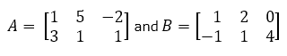
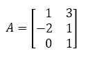
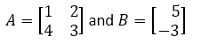
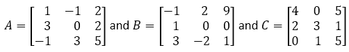
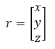
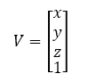
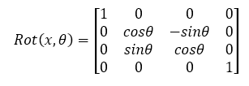
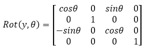
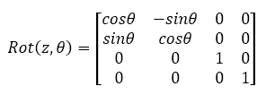
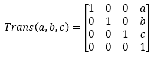

# AI Programming - Assignment 1

<!--Delete the instructions below-->

## Getting started

1. To start clone this repository:

```bash
git clone git@github.com:ai-programming-21/assignment1-<your username here>.git
```

1. Complete the assignment and your report.
1. Commit and push your solution. It is advised to make a commit for each part of the solution.

```bash
git add .
git commit -m"describe the commit here"
git push origin main

```

Make sure your python code snippets are placed in Python code blocks.  See examples in this README.md file. Make sure these code snippets have a valid Python syntax. Fill in your name at the designated spot.

<!--Delete the instruction above -->

Name: <!--Insert your name here -->

---

## Introduction

**NumPy** is a Python package. It stands for 'Numerical Python'. It is a library consisting of multidimensional array objects and a collection of routines for processing of array.

**NumPy** is often used along with packages like **SciPy** (Scientific Python) and **Matplotlib** (plotting library). This combination is widely used as a replacement for MatLab, a popular platform for technical computing.

**NumPy** and **SciPy** are open-source add-on modules to Python that provide common mathematical and numerical routines in pre-compiled, fast functions. These are growing into highly mature packages that provide functionality that meets, or perhaps exceeds, that associated with common commercial software like MatLab.

The **NumPy** (Numeric Python) package provides basic routines for manipulating large arrays and matrices of numeric data.

The **SciPy** (Scientific Python) package extends the functionality of **NumPy** with a substantial collection of useful algorithms, like minimization, Fourier transformation, regression, and other applied mathematical techniques.

However, Python as an alternative to MatLab is now seen as a more modern and has the advantage of being a complete programming language. It is open source, which is an added advantage of **NumPy**.

## Vectors

### Operations on vectors

#### Representing vectors

The simplest way to represent vectors in Python is using a list structure. A vector is constructed by giving the list of elements surrounded by square brackets, with the elements separated by commas.

The assignment operator = is used to give a name to the list. The len() function returns the size (dimension).

```python
x = [-1.1, 0.0, 3.6, 7.2]
len(x)
```

| Assignment |
| :--------- |
| Execute the Python code and print the value len(x). |
| **Solution:** |
| <!--Insert here -->|

Another common way to represent vectors in Python is to use a **numpy** array. To do so, we must first import the **numpy** package.

```python
import numpy as np
x = np.array([-1.1, 0.0, 3.6, 7.2])
len(x)
```

| Assignment |
| :--------- |
| Execute the Python code and print the value len(x). |
| **Solution:** |
| <!--Insert here -->|

#### Vector addition and substraction

If **x** and **y** are **numpy** arrays of the same size, **x+y** and **x-y** give their sum and difference, respectively.

```python
import numpy as np
x = np.array([1,2,3])
y = np.array([100,200,300])
print('Sum of arrays:', x+y)
print('Difference of arrays:', x-y)
```

| Assignment |
| :--------- |
| Execute the Python code. |
| What are the results of the two print statements. |
| Explain the results. |
| **Solution:** |
| <!--Insert here -->|

#### Scalar-vector multiplication and division

If *a* is a number and **x** is a **numpy** array (vector), you can express the scalar-vector product either as **a*x** or **x*a**.

```python
import numpy as np
x = np.array([1,2,3])
print('Sum of arrays:', 2.2 * x)

```

You can carry out scalar-vector division as **x/a**.

```python
import numpy as np
x = np.array([1,2,3])
print('Sum of arrays:', x / 2.2)

```

| Assignment |
| :--------- |
| Execute the Python code of both examples. |
| What are the results? |
| Explain the results. |
| **Solution:** |
| <!--Insert here -->|

#### Linear combination of vectors

You can form a linear combination in Python using scalar-vector multiplication and addition.

```python
import numpy as np
a = np.array([1,2])
b = np.array([3,4])
alpha = -0.5
beta = 1.5
c = alpha * a + beta * b 
print(c)

```

| Assignment |
| :--------- |
| Execute the Python code of both examples. |
| What is the value of c? |
| Explain the results. |
| **Solution:** |
| <!--Insert here -->|

To illustrate some additional Python syntax, we create a function that takes a list of coefficients and a list of vectors as its argument (input), and returns the linear combination (output).

```python
def lincomb(coef, vectors):
    n = len(vectors[0])
    comb = np.zeros(n)
    for i in range(len(vectors)):
        comb = comb + coef[i] * vectors[i]
    return comb

lincomb([alpha, beta], [a,b])
```

| Assignment |
| :--------- |
| Assign values to variables a, b, alpha and beta.|
| Execute the Python code and print the value of variable lincomb. |
| What is the result? |
| Explain the result. |
| **Solution:** |
| <!--Insert here -->|

#### Inner product

The inner product of n-vector x and y is denoted as **x<sup>T</sup> y**. 
In Python the inner product of x and y can be found using **np.inner(x,y)**

```python
import numpy as np
a = np.array([-1,2,2])
b = np.array([1,0,-3])
print(np.inner(x,y))

```

| Assignment |
| :--------- |
| Execute the Python code and print the value of the inner product.|
| What is the result? |
| Explain the result. |
| **Solution:** |
| <!--Insert here -->|

#### Checking properties

Let's check the distributive property *β.(a+b)= β.a+ β.b* which holds for any two n-vector a and b, and any scalar β.

```python
import numpy as np
a = np.random.random(3)
b = np.random.random(3)
beta = np.random.random()
lhs = beta*(a+b)
rhs = beta*a + beta*b
print('a:',a)
print('b:',b)
print('beta:',beta)
print('LHS:',lhs)
print('RHS:',rhs)
```

| Assignment |
| :--------- |
| Execute the Python code.|
| What is the result? |
| Explain the result. |
| **Solution:** |
| <!--Insert here -->|

## Linear functions

### Functions in Python

Python provides several methods for defining functions. One simple way is to use lambda functions. A simple function given by an expression such as **f(x)=x<sub>1</sub>+x<sub>2</sub>-x<sup>2</sup><sub>4</sub>** can be defined in a single line.

```python
f = lambda x: x[0] + x[1] - x[3]**2
f([-1,0,1,2])
```

| Assignment |
| :--------- |
| Execute the Python code and print the value of variable f.|
| What is the result? |
| Explain the result. |
| **Solution:** |
| <!--Insert here -->|

### Average function

Let's define the average function in Python and check its value of a specific vector. (Numpy also contains an average function, which can be called with np.mean).

```python
avg = lambda x: sum(x)/len(x)
x = [1,-3,2,-1]
avg(x)
```

| Assignment |
| :--------- |
| Execute the Python code and print the value of variable f.|
| What is the result? |
| Explain the result. |
| **Solution:** |
| <!--Insert here -->|

## Matrices

### Matrix addition

In Python, addition and subtraction of matrices, and scalar-matrix multiplication, both follow standard and mathematical notation.

```python
U = np.array([[0,4], [7,0], [3,1]])
V = np.array([[1,2], [2,3], [0,4]])
U+V
```

| Assignment |
| :--------- |
| Execute the Python code.|
| What is the result? |
| Explain the result. |
| **Solution:** |
| <!--Insert here -->|

### Inverse

If A is invertible, its inverse is given by np.linalg.inv(A). 
You'll get an error if A is not invertible, or not square.

```python
A = np.array([[1,-2,3], [0,2,2], [-4,-4,-4]])
B = np.linalg.inv(A)
B
```

| Assignment |
| :--------- |
| Execute the Python code.|
| What is the result? |
| Explain the result. |
| **Solution:** |
| <!--Insert here -->|

### Exercises

#### Matrix addition and substraction



| Assignment |
| :--------- |
| Write the Python code for|
| A+B, B+A, A-B, B-A |
| What is your conclusion? |
| **Solution:** |
| <!--Insert here -->|

#### Scalar multiplication



| Assignment |
| :--------- |
| Write the Python code for|
| 2.A |
| -3.A |
| ½.A|
| **Solution:** |
| <!--Insert here -->|

#### Matrix multiplication



| Assignment |
| :--------- |
| Write the Python code for|
| C=A.B |
| **Solution:** |
| <!--Insert here -->|



| Assignment |
| :--------- |
| Write the Python code for|
| B.C |
| A(B.C) |
| (A.B).C |
| What is your conclusion? |
| **Solution:** |
| <!--Insert here -->|

#### Translation and rotation of vectors

Consider the point P with position vector in 3D given by:



In order to translate and rotate this vector it is useful to introduce an augmented vector V given by:



It is then possible to define several matrices:







With θ being the angle of rotation around the respective axis.



With a, b, and c being the respective translations along the x, y and z axis.

| Assignment |
| :--------- |
| Write functions which rotate a position vector. around and translate a position vector along the axis.|
| In total 6 functions: translateX, translateY, translateZ and rotateX, rotateY, rotateZ. |
| Provide examples for each of these functions.|
| **Solution:** |
| <!--Insert here -->|

## Plotting data with matplotlib

### Plotting temperature data

There are several external packages for creating plots in Python. One such
package is matplotlib, which comes with the Anaconda distribution.

```python
import matplotlib.pyplot as plt
plt.ion()
temps = [ 71, 71, 68, 69, 68, 69, 68, 74, 77, 82, 85, 86, 88, 86, 85, 86, 84, 79, 77, 75, 73, 71, 70, 70, 69, 69, 69, 69, 67, 68, 68, 73, 76, 77, 82, 84, 84, 81, 80, 78, 79, 78, 73, 72, 70, 70, 68, 67 ]
plt.plot(temps, '-bo')
plt.savefig('temperature.pdf', format = 'pdf')
plt.show()
```

| Assignment |
| :--------- |
| Execute the python code of the example and place the observed plot in the file here.|
| **Solution:** |
| <!--Insert here -->|

### Plotting mathematical functions

```python
import matplotlib
import matplotlib.pyplot as plt
import numpy as np
# Data for plotting
t = np.arange(0.0, 2.0, 0.01)
s = 1 + np.sin(2 * np.pi * t)

fig, ax = plt.subplots()
ax.plot(t, s)

ax.set(xlabel='time (s)', ylabel='voltage (mV)',
title='About as simple as it gets, folks')
ax.grid()

fig.savefig("test.png")
plt.show()
matplotlib.axes.Axes.plot
matplotlib.pyplot.plot
matplotlib.pyplot.subplots
matplotlib.figure.Figure.savefig

```

| Assignment |
| :--------- |
| Execute the python code of the example and place the observed plot in the file here.|
| Change the Python code and plot the following function: y(t) = A.sin⁡(ω.t+φ), choose A, ω and φ. |
| Change the Python code a sine and cosine function in the same plot. Choose ω. |
| **Solution:** |
| <!--Insert plots here -->|

### Geometric transformations

In this example we create a rotation matrix and use it to rotate a random set of points.

```python
import numpy as np
import matplotlib
import matplotlib.pyplot as plt

# rotate a set of points pi/3 radians (60 deg)
Rot = lambda theta: [[np.cos(theta), -np.sin(theta)],[np.sin(theta), np.cos(theta)]]
R = Rot(np.pi/3)
print(R)

#create a list of 2-D points
points = np.array([[1,0],[1.5,0],[2,0],[1,0.25],[1.5,0.25],[1,0.5]])
#Now rotate them
rpoints = np.array([R @ p for p in points])
#Show the two sets of points
plt.ion()
plt.scatter([c[0] for c in points], [c[1] for c in points])
plt.scatter([c[0] for c in rpoints],[c[1] for c in rpoints])
plt.show()
wait = input("Press Enter to continue.")

```

| Assignment |
| :--------- |
| Execute the python code of the example and place the observed plot in the file here.|
| Change the Python code and plot the rotations π/4, π/2, 3π/4 radians in the same plot.|
| Change the Python code to use your own rotation function as defined in "translation and rotation of vectors". |
| **Solution:** |
| <!--Insert plots here -->|

### Clustering of data

In this example we cluster a randomly generated set of N = 300 points in three groups.

```python
import numpy as np
import matplotlib
import matplotlib.pyplot as plt
plt.ion()
X = np.concatenate([[0.3*np.random.randn(2) for i in range(100)],
[[1,1] + 0.3*np.random.randn(2) for i in range(100)], [[1,-1]
+ 0.3* np.random.randn(2) for i in range(100)]])

plt.subplot(2,1,1)
plt.scatter( X[:,0],X[:,1])
plt.xlim(-1.5,2.5)
plt.ylim(-2,2)
plt.show()

from sklearn.cluster import KMeans
kmeans = KMeans(n_clusters=3, random_state=0).fit(X)
labels = kmeans.labels_
group_representative = kmeans.cluster_centers_
J_clust = kmeans.inertia_
grps = [[X[i,:] for i in range(300) if labels[i]==j] for j in range(3)]
plt.subplot(2,1,2)
plt.scatter([c[0] for c in grps[0]],[c[1] for c in grps[0]])
plt.scatter([c[0] for c in grps[1]],[c[1] for c in grps[1]])
plt.scatter([c[0] for c in grps[2]],[c[1] for c in grps[2]])
plt.xlim(-1.5,2.5)
plt.ylim(-2,2)
plt.show()
wait = input("Press Enter to continue.")

```

| Assignment |
| :--------- |
| Execute the python code of the example and place the observed plot in the file here.|
| Change the code to generate 1000 random points and cluster the random data in 5 groups. Plot the results |
| **Solution:** |
| <!--Insert plots here -->|

## Further information

* [Matrices in Python](https://www.w3schools.in/python-data-science/matrices-in-python/)
* [Matrix Arithmetics under NumPy and Python](https://www.python-course.eu/matrix_arithmetic.php)
* [Matrix manipulation in Python](https://www.tutorialspoint.com/matrix-manipulation-in-python)
* [Vectors, Matrices and Arrays in NumPy](https://www.oreilly.com/library/view/machine-learning-with/9781491989371/ch01.html)
